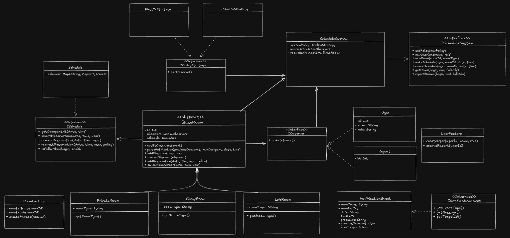

# Sistema de Reserva de Salas de Estudo

Uma aplicação desenvolvida em Java orientada a objetos para o gerenciamento de reservas de salas (estudo individual, trabalho em grupo e laboratórios) em um campus universitário.

## Visão Geral

Este projeto implementa o domínio lógico de um sistema de agendamento, garantindo a detecção de colisões de horários, regras dinâmicas de prioridade e um sistema de notificações orientado a eventos. A arquitetura foi desenhada para ter baixo acoplamento e alta coesão, seguindo princípios SOLID e isolando as regras de negócio de suas respectivas infraestruturas.

### Diagrama de classes

## Funcionalidades Principais

* **Consulta de Disponibilidade:** Verificação de salas livres ou ocupadas em intervalos de datas específicos.

* **Gestão de Reservas:** Criação, modificação e cancelamento seguro de agendamentos por usuários.
* **Políticas Dinâmicas:** Tratamento de conflitos de horário com troca de políticas em tempo de execução (ex: regra do "primeiro a chegar" vs. "prioridade para docentes").
* **Notificações em Tempo Real:** Alertas automatizados aos envolvidos em casos de confirmação, cancelamento ou sobrescrita de reservas.
* **Auditoria:** Geração de relatórios em log que atuam como observadores independentes do sistema.

## Arquitetura e Padrões de Projeto

O sistema foi estruturado priorizando a eficiência de busca e armazenamento, utilizando coleções nativas como `HashMap` para o mapeamento e iteração rápida do catálogo de salas e dicionários aninhados para a agenda, além de `ArrayList` para a indexação sequencial de usuários. A manipulação temporal é feita através da API nativa `LocalDate` com formatação customizada no padrão `yyyyMMdd`.

Os seguintes Padrões de Projeto (GoF) compõem a fundação da arquitetura:

* **Factory Method:** Utilizado para a instanciação das diferentes subclasses de sala sem acoplar o sistema central às implementações concretas.

* **Strategy (`IPolicyStrategy`):** Encapsula as regras de validação de disponibilidade e sobrescrita de reservas, isolando as tomadas de decisão da estrutura de dados da agenda.
* **Observer (`IObserver`):** Implementado por meio de uma arquitetura limpa de eventos (`NotificationEvent`). Usuários e relatórios atuam como assinantes e reagem de forma polimórfica às mudanças de estado nas salas.
* **Singleton:** Garante uma instância única e controlada para o repositório principal e as configurações em memória do `ScheduleSystem`.
* **Template Method:** Define o esqueleto de processos padronizados de análise e roteamento de notificações na classe base abstrata.

## Estrutura do Repositório

A organização de pastas reflete a separação de responsabilidades da aplicação:

* `src/`: Código-fonte principal.
* `events/`: Definição de objetos de transferência de dados (DTOs) para os eventos do sistema.
* `factories/`: Lógica de criação de entidades.
* `interfaces/`: Contratos principais do sistema.
* `observers/`: Entidades que reagem aos eventos (Usuários e Relatórios).
* `policies/`: Implementações concretas das estratégias de validação.
* `rooms/`: Hierarquia de classes representando os espaços físicos.
* `schedule/`: Domínio responsável pelo gerenciamento de dicionários e controle de tempo.

* `docs/`: Diagramas UML e documentação complementar de modelagem.
* `README.md`: Instruções e visão geral do projeto.

## Autores

* **Felipi dos Santos Martins** - Bacharelado Interdisciplinar em Ciência e Tecnologia (BCT) / Engenharia da Computação, UNIFESP.
* **Gabriel Delgado Panovich de Barros** - Bacharelado Interdisciplinar em Ciência e Tecnologia (BCT) / Ciência da Computação, UNIFESP.
